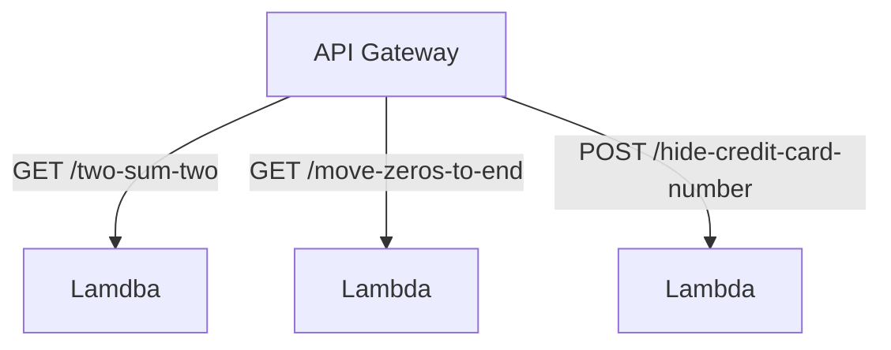

## Take home exam

The three questions are answered with unit tests and deployed as lambdas behind a single API gateway.

The project was initialised using:

> cdk init app --language typescript

## Test:

npm run test

## Deploy:

npm run deploy

